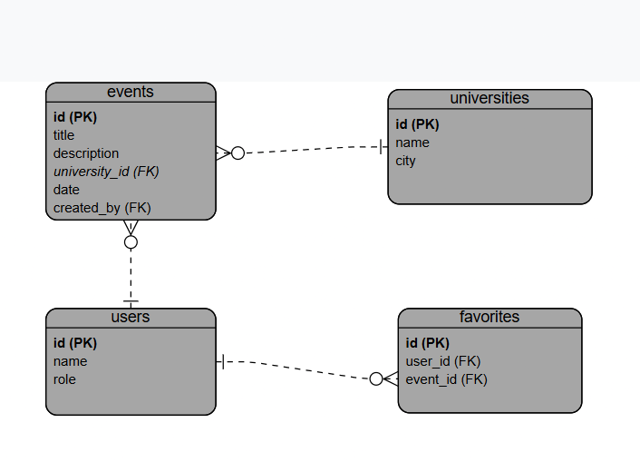

# Event Hub: Backend API

## Project & Repository Descriptions

This repository contains the backend for the Event Hub capstone project. Event Hub is a platform designed to help universities organize, manage, and promote their events. This Django REST Framework API handles all server-side logic, including data management for universities and events, user authentication, and a favorites system. It provides the RESTful endpoints that are consumed by the React frontend application.

## Tech Stack

-   **Language:** Python
-   **Framework:** Django & Django REST Framework
-   **Database:** PostgreSQL
-   **Authentication:** JSON Web Tokens (JWT)
-   **Containerization:** Docker & Docker Compose

## Frontend Repository

You can find the  React frontend repository here:
- **Backend:** [Backend Repo](https://github.com/Norah-b12/backend-capstone)  
- **Frontend:** [Frontend Repo](https://github.com/Norah-b12/frontend-capstone)  

## Link to Deployed Site

*Link to the deployed backend or full application will be available here.*

## ERD Diagram

The application's data structure is based on the following three related models: `University`, `Event`, and `Favorite`.



## Routing Table

The API provides RESTful endpoints for all core resources. All endpoints are prefixed with `/api/`.

<h3>Universities</h3>
<table border="1">
<tr><th>HTTP Verb</th><th>Path</th><th>Action</th><th>Description</th></tr>
<tr><td>GET</td><td>/universities</td><td>index</td><td>List all universities</td></tr>
<tr><td>POST</td><td>/universities</td><td>create</td><td>Create a new university (admin only)</td></tr>
<tr><td>GET</td><td>/universities/:id</td><td>show</td><td>Show details of a university and its events</td></tr>
<tr><td>PUT/PATCH</td><td>/universities/:id</td><td>update</td><td>Update university information</td></tr>
<tr><td>DELETE</td><td>/universities/:id</td><td>destroy</td><td>Delete a university (admin only)</td></tr>
</table>

<h3>Events</h3>
<table border="1">
<tr><th>HTTP Verb</th><th>Path</th><th>Action</th><th>Description</th></tr>
<tr><td>GET</td><td>/events</td><td>index</td><td>List all events from all universities</td></tr>
<tr><td>POST</td><td>/universities/:university_id/events</td><td>create</td><td>Create a new event under a specific university (organizer only)</td></tr>
<tr><td>GET</td><td>/events/:id</td><td>show</td><td>Show detailed information about a specific event</td></tr>
<tr><td>PUT/PATCH</td><td>/events/:id</td><td>update</td><td>Update event information (organizer only)</td></tr>
<tr><td>DELETE</td><td>/events/:id</td><td>destroy</td><td>Delete an event (organizer only)</td></tr>
</table>

<h3>Favorites</h3>
<table border="1">
<tr><th>HTTP Verb</th><th>Path</th><th>Action</th><th>Description</th></tr>
<tr><td>GET</td><td>/favorites</td><td>index</td><td>List all favorite events for the logged-in user</td></tr>
<tr><td>POST</td><td>/favorites</td><td>create</td><td>Add an event to user favorites</td></tr>
<tr><td>DELETE</td><td>/favorites/:id</td><td>destroy</td><td>Remove an event from favorites</td></tr>
</table>

<h3>Users</h3>
<table border="1">
<tr><th>HTTP Verb</th><th>Path</th><th>Action</th><th>Description</th></tr>
<tr><td>POST</td><td>/users/signup</td><td>create</td><td>Register a new user</td></tr>
<tr><td>POST</td><td>/users/login</td><td>create</td><td>Authenticate and log in a user</td></tr>
<tr><td>GET</td><td>/users/profile</td><td>show</td><td>Display logged-in user information</td></tr>
</table>

<br><br>


## Installation Instructions (Docker)

This project is containerized using Docker and Docker Compose for a streamlined setup.

1. **Clone the repository:**
    ```bash
    git clone https://github.com/Norah-b12/backend-capstone.git
    cd backend-capstone
    ```


2.  **Configure Environment Variables:**
    Create a `.env` file in the root directory by copying the `.env.example` file. Update the `.env` file with your specific settings (e.g., `SECRET_KEY`, database credentials).

3.  **Build and Run Containers:**
    From the root directory, run the following command to build the images and start the containers:
    ```bash
    docker-compose up --build
    ```
    This will start the backend server on `http://localhost:8000` and the PostgreSQL database in a separate container.

## IceBox Features

The following features are planned for future releases but are not yet implemented:

- **Event Reminders & Notifications:** Backend support for sending emails or push notifications for upcoming events  
- **User Comments & Ratings:** Allow users to comment on events and rate them, stored and managed via API  
- **Advanced Event Filtering:** Backend endpoints for filtering events by date range, popularity, or custom queries  
- **Event Media Management:** Support for uploading and storing event images or documents via API  
- **Analytics & Reporting:** Backend tracking for event popularity, user activity, and favorite trends  